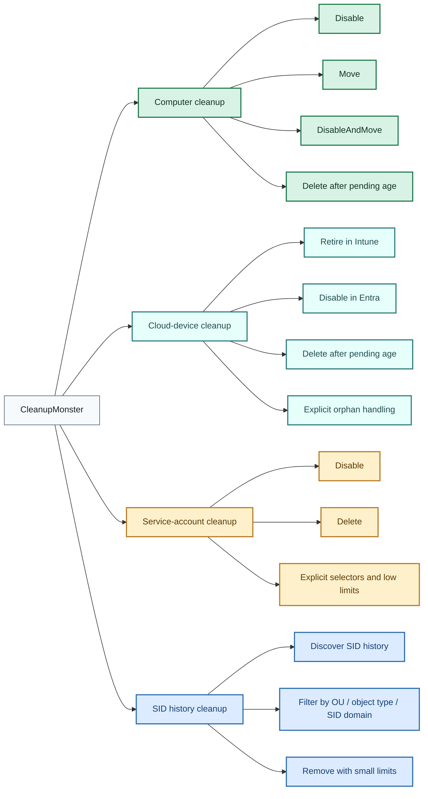
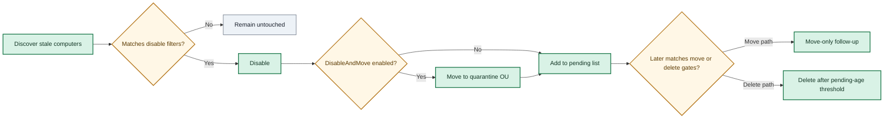
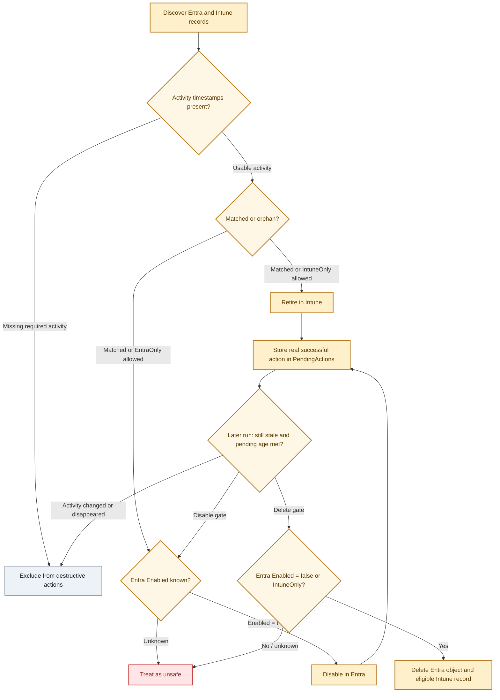
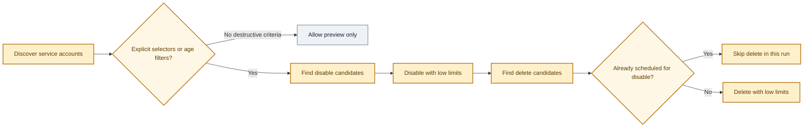
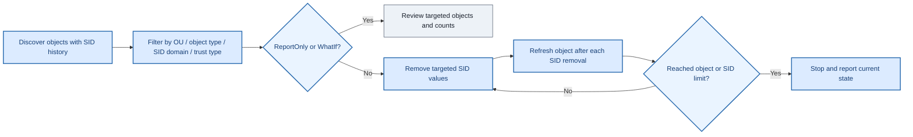

# CleanupMonster - PowerShell Module

<p align="center">
  <a href="https://www.powershellgallery.com/packages/CleanupMonster"></a>
  <a href="https://www.powershellgallery.com/packages/CleanupMonster"></a>
  <a href="https://github.com/EvotecIT/CleanupMonster"></a>
</p>

<p align="center">
  <a href="https://www.powershellgallery.com/packages/CleanupMonster"></a>
  <a href="https://github.com/EvotecIT/CleanupMonster"></a>
  <a href="https://github.com/EvotecIT/CleanupMonster"></a>
  <a href="https://www.powershellgallery.com/packages/CleanupMonster"></a>
</p>

<p align="center">
  <a href="https://twitter.com/PrzemyslawKlys"></a>
  <a href="https://evotec.xyz/hub"></a>
  <a href="https://www.linkedin.com/in/pklys"></a>
  <a href="https://evo.yt/discord"></a>
</p>

`CleanupMonster` is a PowerShell module that helps you clean up **Active Directory** and stale cloud device records.

It has multiple functionalities currently & planned:
- [x] Cleanup stale Computer objects from Active Directory
- [x] Cleanup SID History from Active Directory
- [x] Cleanup stale Microsoft Entra registered mobile devices from the cloud side
- [ ] Cleanup stale User objects from Active Directory
- [ ] Cleanup stale Group objects from Active Directory
- [x] Cleanup GMSA/MSA objects from Active Directory

There are 2 blog posts that explain how to use the module:
- [Mastering Active Directory Hygiene: Automating Stale Computer Cleanup with CleanupMonster](https://evotec.xyz/mastering-active-directory-hygiene-automating-stale-computer-cleanup-with-cleanupmonster/)
- [Mastering Active Directory Hygiene: Automating SID History Cleanup with CleanupMonster](https://evotec.xyz/mastering-active-directory-hygiene-automating-sidhistory-cleanup-with-cleanupmonster/)

The solution is really thought through and has many options to customize it to your needs.
It's a complete solution for cleaning up Active Directory.
**Please make sure to run this module with proper permissions or you may get wrong results.**
By default Active Directory domain allows a standard user to read LastLogonDate and LastPasswordSet attributes.
If you have changed those settings you may need to run the module with elevated permissions even for reporting needs.

## Support This Project

If you find this project helpful, please consider supporting its development.
Your sponsorship will help the maintainers dedicate more time to maintenance and new feature development for everyone.

It takes a lot of time and effort to create and maintain this project.
By becoming a sponsor, you can help ensure that it stays free and accessible to everyone who needs it.

To become a sponsor, you can choose from the following options:

 - [Become a sponsor via GitHub Sponsors :heart:](https://github.com/sponsors/PrzemyslawKlys)
 - [Become a sponsor via PayPal :heart:](https://paypal.me/PrzemyslawKlys)

Your sponsorship is completely optional and not required for using this project.
We want this project to remain open-source and available for anyone to use for free,
regardless of whether they choose to sponsor it or not.

If you work for a company that uses our .NET libraries or PowerShell Modules,
please consider asking your manager or marketing team if your company would be interested in supporting this project.
Your company's support can help us continue to maintain and improve this project for the benefit of everyone.

Thank you for considering supporting this project!

# Installation

```powershell
Install-Module -Name CleanupMonster -Force -Verbose
```

## Introduction ✨

CleanupMonster is built for teams that want Active Directory cleanup to feel deliberate, staged, and reviewable instead of risky and opaque. Every cleanup path starts with discovery, can generate HTML output for review, and can be wrapped in limits, pending lists, and `WhatIf` controls before anything destructive happens.

Whether you are retiring stale computers, pruning unused `MSA` / `gMSA` objects, or removing legacy SID history after migrations, the module is designed to help you choose the right cleanup track for the problem in front of you.

> [!WARNING]
> Run the module with the permissions required to read the attributes you rely on. In a default AD configuration that often includes `LastLogonDate` and `PasswordLastSet`, but hardened environments may require elevated rights even for reporting-only runs.

## Overview 🧭

CleanupMonster is easiest to understand as four end-to-end cleanup paths. They all start with discovery and reporting, but each one is optimized for a different cleanup problem.

> [!TIP]
> If you are new to the module, start with `-ReportOnly` and `-WhatIf`, keep limits low, and validate the generated HTML output before enabling destructive actions.



| Area | Cmdlet | Best for | Typical actions | Recommended mindset |
| --- | --- | --- | --- | --- |
| Computer cleanup | `Invoke-ADComputersCleanup` | Stale computer lifecycle management in AD, optionally cross-checked against Azure AD, Intune, and Jamf | Disable, move, disable-and-move, delete | Stage changes across multiple runs |
| Cloud device cleanup | `Invoke-CloudDevicesCleanup` | Stale Microsoft Entra registered mobile devices that need Intune retire and Entra cleanup | Retire, disable, delete | Retire first, then enforce grace periods |
| Service-account cleanup | `Invoke-ADServiceAccountsCleanup` | Reviewing and cleaning stale `MSA` / `gMSA` objects with stronger destructive-run guardrails | Disable, delete | Start narrow and require explicit selectors |
| SID history cleanup | `Invoke-ADSIDHistoryCleanup` | Removing legacy SID history entries with detailed before/after reporting | Report, selective remove | Start with discovery and tiny limits |

## Quick Start 🚀

Recommended first commands for each path:

```powershell
# Computer cleanup preview
Invoke-ADComputersCleanup -Disable -ReportOnly -WhatIf -ShowHTML

# Cloud device cleanup preview
Invoke-CloudDevicesCleanup -Retire -ReportOnly -WhatIf -ShowHTML

# Service-account cleanup preview
Invoke-ADServiceAccountsCleanup -Disable -ReportOnly -WhatIf -IncludeAccounts 'gmsa-*'

# SID history cleanup preview
Invoke-ADSIDHistoryCleanup -ReportOnly -WhatIf
```

## Cleanup Paths 🧰

### Computer Cleanup 🖥️

Computer cleanup is the richest workflow in the module. It is built for staged remediation of stale computer objects rather than one immediate destructive pass.

Use it when you want to:

- find stale AD computer objects
- optionally require Azure AD, Intune, or Jamf inactivity before actioning AD
- disable first and delete later
- move devices to a quarantine OU before final deletion
- keep a pending list as a safety buffer across multiple runs

Typical lifecycle:



What matters most:

- `-WhatIf` now flows to move actions as well as disable/delete actions
- `-Move` is a first-class path, not just a side effect of disable
- `-DisableAndMove` behaves like a disable workflow during discovery and then performs the move during execution
- pending-list timing in the datastore lets you separate disable, move, and delete into different operational windows

Good starter profiles:

- pilot: `-ReportOnly -WhatIf -Disable`
- staged remediation: `-Disable` now, then `-DeleteListProcessedMoreThan` later
- quarantine-first: `-DisableAndMove -DisableMoveTargetOrganizationalUnit ...`
- cloud-aware cleanup: add Azure AD / Intune / Jamf inactivity thresholds and safety limits

Relevant examples:

- `Examples/DeleteComputers.ps1`
- `Examples/DeleteComputersWithMoveAndEmail.ps1`
- `Examples/DeleteComputersWithO365.ps1`
- `Examples/DeleteComputersWithO365andJAMF.ps1`

### Cloud Device Cleanup 📱

Cloud device cleanup is the Microsoft Entra and Intune companion workflow for stale mobile devices. It is intentionally separate from AD computer cleanup because the lifecycle is different: Intune-managed devices should normally be retired first, while Microsoft Entra directory objects should be disabled and held for a grace period before final deletion.

Use it when you want to:

- review stale Microsoft Entra registered `iOS` and `Android` devices
- distinguish matched devices from `EntraOnly` and `IntuneOnly` orphan records
- retire managed devices first and keep a pending list before later disable/delete steps
- clean up Intune-only orphan records that no longer have a matching Entra device object

Typical lifecycle:



What matters most:

- inventory now includes `Matched`, `EntraOnly`, and `IntuneOnly` record states
- action candidates include a `SelectionReason` so reports explain why a device qualified
- orphan records are discovered by default, but stage-specific orphan processing now requires explicit switches
- default scope is mobile-first: `iOS` and `Android`, with company-owned devices excluded unless requested
- blank current activity is unsafe for destructive selection, including when a pending device had activity before but the current inventory loses it
- Entra-backed disable requires `Enabled -eq $true`; Entra-backed delete requires `Enabled -eq $false`; unknown enabled state is treated as unsafe
- `-ReportOnly`, top-level `-WhatIf`, and action-specific preview switches do not add devices to `PendingActions` or persisted `History`
- `-Confirm` prompts at the top-level action stage before destructive retire, disable, or delete requests are submitted

Recommended production stance:

- discover all record states in the report
- action matched records first
- enable `-RetireIncludeIntuneOnly`, `-DisableIncludeEntraOnly`, `-DeleteIncludeEntraOnly`, and `-DeleteIncludeIntuneOnly` only after reviewing orphan behavior in your tenant
- use `SafetyEntraLimit` and `SafetyIntuneLimit` to stop cleanup when Graph returns suspiciously low inventory
- keep `RetireLimit`, `DisableLimit`, and `DeleteLimit` low until the report output matches expectations
- store `DataStorePath` somewhere durable and backed up, because staged cleanup depends on the pending-action history

Relevant examples:

- `Examples/CleanupCloudDevicesPreview.ps1`
- `Examples/CleanupCloudDevicesStaged.ps1`

### Service-Account Cleanup 🔐

Service-account cleanup is intentionally narrower and safer than computer cleanup. It is designed for `MSA` and `gMSA` hygiene where you want low limits and explicit destructive intent.

Use it when you want to:

- review stale managed service accounts
- limit scope with age filters or `IncludeAccounts`
- keep disable/delete limits very small during rollout
- avoid disabling and deleting the same account in the same run

Typical lifecycle:



What matters most:

- destructive disable/delete runs require explicit selection criteria
- `IncludeAccounts` counts as an explicit selector
- preview scenarios with `-ReportOnly`, `-WhatIf`, `-WhatIfDisable`, or `-WhatIfDelete` are allowed even without destructive selectors
- accounts scheduled for disable in a run are skipped from delete in that same run

Good starter profiles:

- preview by name pattern: `-Disable -ReportOnly -WhatIf -IncludeAccounts 'gmsa-*'`
- safer scheduled run: explicit include/exclude patterns plus low `DisableLimit` and `DeleteLimit`
- age-based hygiene: combine `LastLogonDateMoreThan`, `PasswordLastSetMoreThan`, and `WhenCreatedMoreThan`

Relevant examples:

- `Examples/CleanupServiceAccounts.ps1`

### SID History Cleanup 🧬

SID history cleanup is for post-migration and trust-hygiene work. It is optimized for discovering targeted SID history entries, filtering them carefully, and removing them with very small limits at first.

Use it when you want to:

- discover which objects still carry SID history
- narrow scope by source SID domain, OU, object type, or trust type
- clean up legacy migration artifacts with strong before/after reporting
- remove only a few SIDs or a few objects per run until the results are proven

Typical lifecycle:



What matters most:

- you can filter by object type, OU, SID source domain, and trust type
- `RemoveLimitSID` and `RemoveLimitObject` let you keep the blast radius intentionally small
- each SID removal is tracked with before/after state so the report remains reviewable even for multi-SID objects

Good starter profiles:

- full discovery: `-ReportOnly -WhatIf`
- migration cleanup by domain SID: use `IncludeSIDHistoryDomain`
- targeted validation run: set both `RemoveLimitSID` and `RemoveLimitObject` to `1` or `2`

Relevant examples:

- `Examples/DeleteSIDHistory.ps1`

## Operational Guards 🛡️

CleanupMonster is designed to be used with multiple layers of safety. You do not need every guard in every environment, but you should choose a guard set deliberately.

### Universal guards

These are good defaults almost everywhere:

- `-ReportOnly` for first-pass validation
- top-level `-WhatIf` for broad previews
- top-level `-Confirm` for interactive confirmation before destructive action batches
- action-specific `-WhatIfRetire`, `-WhatIfDisable`, `-WhatIfMove`, and `-WhatIfDelete` when you want mixed behavior
- low action limits during rollout, then widen later
- HTML reporting plus log files for every scheduled run

### Environment guards

These help ensure your data sources are healthy before any action happens:

- `SafetyADLimit` to stop if AD returns fewer objects than expected
- `SafetyAzureADLimit`, `SafetyIntuneLimit`, and `SafetyJamfLimit` when cloud/device-source validation matters
- `SafetyEntraLimit` and `SafetyIntuneLimit` for cloud-device cleanup to stop on partial Microsoft Graph inventory
- `TargetServers` when you want deterministic domain-controller selection

### Workflow guards

These reduce risk in destructive cleanup patterns:

- pending-list aging via `DeleteListProcessedMoreThan` or `MoveListProcessedMoreThan`
- OU quarantine with `-Move` or `-DisableAndMove`
- exclusions for known-sensitive OUs, names, or systems
- cloud-device activity and enabled-state checks that treat missing data as unsafe for destructive cleanup
- explicit orphan switches before cloud cleanup actions touch `EntraOnly` or `IntuneOnly` records
- service-account explicit selectors before destructive runs
- protected-from-accidental-deletion checks for move/delete operations

### Recommended guard posture by environment

| Environment maturity | Suggested guard set |
| --- | --- |
| First lab / pilot | `-ReportOnly`, top-level `-WhatIf`, low limits, HTML report, log file |
| Early production rollout | Explicit exclusions, low limits, AD safety limit, pending-list staging, action-specific `WhatIf` for risky steps |
| Mature production automation | AD and cloud safety limits, staged disable/delete windows, OU quarantine, durable datastores, reports/logs, explicit target servers where needed |

## Rollout Pattern 🪜

If you are introducing CleanupMonster into an environment for the first time, this is a good default operating model:

1. Run report-only previews and validate the HTML output with your AD owners.
2. Enable disable-only or disable-and-move with low limits.
3. Review pending-list behavior for several runs.
4. Add delete or move-after-delay thresholds only after the staged output is stable.
5. Increase limits gradually once the rules are proven.

For service accounts, start even narrower:

1. use `IncludeAccounts` or very explicit age filters
2. keep `DisableLimit` / `DeleteLimit` low
3. review the report
4. then automate

For cloud devices, treat missing Graph data as a stop sign:

1. run `Invoke-CloudDevicesCleanup -Retire -Disable -Delete -ReportOnly -WhatIf -ShowHTML`
2. review `Matched`, `EntraOnly`, and `IntuneOnly` records separately
3. keep orphan action switches disabled until you understand tenant-specific orphan patterns
4. set `SafetyEntraLimit` and `SafetyIntuneLimit` before production runs
5. enable retire first, then disable/delete only after pending-age behavior is proven

For SID history, start by discovering:

1. run in report mode
2. filter to a known source SID domain, OU, or object type
3. set low `RemoveLimitObject` / `RemoveLimitSID`
4. then expand when the before/after report looks right

## Detailed Walkthroughs 📚

The sections below go deeper into each cleanup path with concrete commands, screenshots, and scheduled-task examples you can adapt for your own environment.

> [!NOTE]
> The earlier sections help you pick the right cleanup track. The walkthroughs below show how to operate each track in practice once you know which one you want.

### Computer Cleanup Walkthrough 🖥️

This is the full staged device-cleanup path, from first report to scheduled automation and cloud-aware validation.

#### Report Only

The first thing you should do is to run the module in a report only mode.
It will show you how many computers are there to disable and delete.

```powershell
$Output = Invoke-ADComputersCleanup -WhatIf -ReportOnly -Disable -Delete -ShowHTML
$Output
```

Keep in mind it works with default values such as 180 days for LastLogonDate and LastPasswordSet.
You can change those values by using parameters.


#### Interactively

This is a sample script that you can use to run the module interactively.
It's good idea to run it interactively first to clean your AD and then run it in a scheduled task.

```powershell
# this is a fresh run and it will try to disable computers according to it's defaults
$Output = Invoke-ADComputersCleanup -Disable -WhatIfDisable -ShowHTML
$Output
```

When you run cleanup the module will deliver HTML report on every run.
It will show you:

- Devices in Current Run (Actioned)


- Devices in Previous Runs (History)


- Devices on Pending List (Pending deletion)


- All Devices (All) remaining


Another example with log settings and custom report path

```powershell
# this is a fresh run and it will try to delete computers according to it's defaults
$Output = Invoke-ADComputersCleanup -Delete -WhatIfDelete -ShowHTML -LogPath $PSScriptRoot\Logs\DeleteComputers_$((Get-Date).ToString('yyyy-MM-dd_HH_mm_ss')).log -ReportPath $PSScriptRoot\Reports\DeleteComputers_$((Get-Date).ToString('yyyy-MM-dd_HH_mm_ss')).html
$Output
```

#### Protected computer objects

If a computer is protected from accidental deletion, `-RemoveProtectedFromAccidentalDeletionFlag` now applies only to move and delete actions.
Disable-only runs will leave that protection in place.

```powershell
$Output = Invoke-ADComputersCleanup `
    -Disable `
    -DisableAndMove `
    -DisableMoveTargetOrganizationalUnit 'OU=Disabled,DC=contoso,DC=com' `
    -RemoveProtectedFromAccidentalDeletionFlag `
    -WhatIfDisable `
    -ShowHTML
$Output
```

#### Scheduled task

This is a sample script that you can use to run the module in a scheduled task. It's a good idea to run it as a scheduled task as it will log all the actions and you can easily review them. It's very advanced with many options and you can easily customize it to your needs.

```powershell
# Run the script
$Configuration = @{
    Disable                        = $true
    DisableNoServicePrincipalName  = $null
    DisableIsEnabled               = $true
    DisableLastLogonDateMoreThan   = 90
    DisablePasswordLastSetMoreThan = 90
    DisableExcludeSystems          = @(
        # 'Windows Server*'
    )
    DisableIncludeSystems          = @()
    DisableLimit                   = 2 # 0 means unlimited, ignored for reports
    DisableModifyDescription       = $false
    DisableModifyAdminDescription  = $true

    Delete                         = $true
    DeleteIsEnabled                = $false
    DeleteNoServicePrincipalName   = $null
    DeleteLastLogonDateMoreThan    = 180
    DeletePasswordLastSetMoreThan  = 180
    DeleteListProcessedMoreThan    = 90 # 90 days since computer was added to list
    DeleteExcludeSystems           = @(
        # 'Windows Server*'
    )
    DeleteIncludeSystems           = @(

    )
    DeleteLimit                    = 2 # 0 means unlimited, ignored for reports

    Exclusions                     = @(
        '*OU=Domain Controllers*'
        '*OU=Servers,OU=Production*'
        'EVOMONSTER$'
        'EVOMONSTER.AD.EVOTEC.XYZ'
    )

    Filter                         = '*'
    WhatIfDisable                  = $true
    WhatIfDelete                   = $true
    LogPath                        = "$PSScriptRoot\Logs\DeleteComputers_$((Get-Date).ToString('yyyy-MM-dd_HH_mm_ss')).log"
    DataStorePath                  = "$PSScriptRoot\DeleteComputers_ListProcessed.xml"
    ReportPath                     = "$PSScriptRoot\Reports\DeleteComputers_$((Get-Date).ToString('yyyy-MM-dd_HH_mm_ss')).html"
    ShowHTML                       = $true
}

# Run one time as admin: Write-Event -ID 10 -LogName 'Application' -EntryType Information -Category 0 -Message 'Initialize' -Source 'CleanupComputers'
$Output = Invoke-ADComputersCleanup @Configuration
$Output
```

#### Cloud-aware scheduled task

This is a sample script that you can use to run the module in a scheduled task. It's a good idea to run it as a scheduled task as it will log all the actions and you can easily review them. It's very advanced with many options and you can easily customize it to your needs.

Thi example shows how to use AzureAD, Intune and Jamf to clean up computers in Active Directory where computer also needs needs to be non-existant in AzureAD, Intune and Jamf or have last seen date matches in AzureAD, Intune and Jamf.

This example also moves computers to different OU's as part of the disable process.
When `RemoveProtectedFromAccidentalDeletionFlag` is enabled, the flag is only cleared for the move/delete steps that require it.
For long computer names, cloud matching now falls back through `DNSHostName` and related aliases so truncated AD names can still match Azure AD and Intune records.

```powershell
# connect to graph for Azure AD, Intune (requires GraphEssentials module)
Connect-MgGraph -Scopes Device.Read.All, DeviceManagementManagedDevices.Read.All, Directory.ReadWrite.All, DeviceManagementConfiguration.Read.All
# connect to jamf (requires PowerJamf module)
Connect-Jamf -Organization 'aaa' -UserName 'aaa' -Suppress -Force -PasswordEncrypted 'aaaaa'

$invokeADComputersCleanupSplat = @{
    # safety limits (minimum amount of computers that has to be returned from each source)
    SafetyADLimit                       = 30
    SafetyAzureADLimit                  = 5
    SafetyIntuneLimit                   = 3
    SafetyJamfLimit                     = 50
    # disable settings
    Disable                             = $true
    DisableLimit                        = 3
    DisableLastLogonDateMoreThan        = 90
    DisablePasswordLastSetMoreThan      = 90
    DisableLastSeenAzureMoreThan   = 90
    DisableLastSyncAzureMoreThan   = 90
    DisableLastContactJamfMoreThan = 90
    DisableLastSeenIntuneMoreThan  = 90
    DisableAndMove                      = $true
    DisableMoveTargetOrganizationalUnit = @{
        'ad.evotec.xyz' = 'OU=Disabled,OU=Computers,OU=Devices,OU=Production,DC=ad,DC=evotec,DC=xyz'
        'ad.evotec.pl'  = 'OU=Disabled,OU=Computers,OU=Devices,OU=Production,DC=ad,DC=evotec,DC=pl'
    }
    # delete settings
    Delete                              = $true
    DeleteLimit                         = 3
    DeleteLastLogonDateMoreThan         = 180
    DeletePasswordLastSetMoreThan       = 180
    DeleteLastSeenAzureMoreThan    = 180
    DeleteLastSyncAzureMoreThan    = 180
    DeleteLastContactJamfMoreThan  = 180
    DeleteLastSeenIntuneMoreThan   = 180
    DeleteListProcessedMoreThan    = 90 # disabled computer has to spend 90 days in list before it can be deleted
    DeleteIsEnabled                     = $false # Computer has to be disabled to be deleted
    # global exclusions
    Exclusions                          = @(
        '*OU=Domain Controllers*' # exclude Domain Controllers
    )
    # filter for AD search
    Filter                              = '*'
    # logs, reports and datastores
    LogPath                             = "$PSScriptRoot\Logs\CleanupComputers_$((Get-Date).ToString('yyyy-MM-dd_HH_mm_ss')).log"
    DataStorePath                       = "$PSScriptRoot\CleanupComputers_ListProcessed.xml"
    ReportPath                          = "$PSScriptRoot\Reports\CleanupComputers_$((Get-Date).ToString('yyyy-MM-dd_HH_mm_ss')).html"
    # WhatIf settings
    #ReportOnly                     = $true
    WhatIfDisable                       = $true
    WhatIfDelete                        = $true
    ShowHTML                            = $true
    RemoveProtectedFromAccidentalDeletionFlag = $true
}

$Output = Invoke-ADComputersCleanup @invokeADComputersCleanupSplat
$Output
```

### Cloud Device Walkthrough 📱

Cloud-device cleanup has its own datastore and report because the cloud lifecycle is staged differently from AD computers. The safest operating model is to preview first, retire stale Intune-managed devices, then use pending-list age before disable/delete stages.

#### Report only

```powershell
$Output = Invoke-CloudDevicesCleanup `
    -Retire `
    -Disable `
    -Delete `
    -ReportOnly `
    -WhatIf `
    -ShowHTML `
    -SafetyEntraLimit 1000 `
    -SafetyIntuneLimit 1000

$Output.CurrentRun
```

This reads existing pending actions so staged candidates are visible, but it does not write updated cleanup state.

#### Retire stale Intune devices

```powershell
$Output = Invoke-CloudDevicesCleanup `
    -Retire `
    -RetireLastSeenIntuneMoreThan 120 `
    -RetireLimit 10 `
    -DataStorePath "$PSScriptRoot\CloudDevices\ProcessedCloudDevices.xml" `
    -ReportPath "$PSScriptRoot\Reports\CloudDevicesRetire.html" `
    -ShowHTML `
    -Confirm

$Output.CurrentRun | Format-Table Name, RecordState, Action, ActionStatus, SelectionReason
```

Successful real retire actions are stored in `PendingActions`. Preview actions from `-WhatIf`, `-WhatIfRetire`, or `-ReportOnly` are not promoted to pending state.

#### Disable after a pending grace period

```powershell
$Output = Invoke-CloudDevicesCleanup `
    -Disable `
    -DisableListProcessedMoreThan 30 `
    -DisableLimit 10 `
    -DataStorePath "$PSScriptRoot\CloudDevices\ProcessedCloudDevices.xml" `
    -ReportPath "$PSScriptRoot\Reports\CloudDevicesDisable.html" `
    -SafetyEntraLimit 1000 `
    -WhatIfDisable `
    -ShowHTML

$Output.CurrentRun
```

Disable is conservative by design. Entra-backed devices are selected only when the current inventory says `Enabled` is exactly `$true`. If Graph omits the enabled state, the device is treated as unsafe and excluded.

#### Delete disabled or Intune-only records

```powershell
$Output = Invoke-CloudDevicesCleanup `
    -Delete `
    -DeleteListProcessedMoreThan 30 `
    -DeleteLimit 5 `
    -DeleteIncludeIntuneOnly `
    -DeleteRemoveIntuneRecord $true `
    -DataStorePath "$PSScriptRoot\CloudDevices\ProcessedCloudDevices.xml" `
    -ReportPath "$PSScriptRoot\Reports\CloudDevicesDelete.html" `
    -WhatIfDelete `
    -ShowHTML

$Output.CurrentRun | Format-Table Name, RecordState, Action, ActionStatus, ActionError
```

Entra-backed delete requires the current inventory to say `Enabled` is exactly `$false`. If a pending device previously had activity timestamps but the current inventory loses them, CleanupMonster will not promote it to the next destructive stage.

#### Full staged cloud profile

```powershell
$invokeCloudDevicesCleanupSplat = @{
    Retire                         = $true
    RetireLastSeenIntuneMoreThan   = 120
    RetireLimit                    = 10

    Disable                        = $true
    DisableListProcessedMoreThan   = 30
    DisableLimit                   = 10

    Delete                         = $true
    DeleteListProcessedMoreThan    = 30
    DeleteLimit                    = 5
    DeleteRemoveIntuneRecord       = $true

    IncludeOperatingSystem         = @('iOS*', 'Android*')
    ExcludeOperatingSystem         = @('*Dedicated*')
    IncludeCompanyOwned            = $false

    SafetyEntraLimit               = 1000
    SafetyIntuneLimit              = 1000
    DataStorePath                  = "$PSScriptRoot\CloudDevices\ProcessedCloudDevices.xml"
    ReportPath                     = "$PSScriptRoot\Reports\CloudDevices_$((Get-Date).ToString('yyyy-MM-dd_HH_mm_ss')).html"
    LogPath                        = "$PSScriptRoot\Logs\CloudDevices_$((Get-Date).ToString('yyyy-MM-dd_HH_mm_ss')).log"

    WhatIfRetire                   = $true
    WhatIfDisable                  = $true
    WhatIfDelete                   = $true
    ShowHTML                       = $true
}

$Output = Invoke-CloudDevicesCleanup @invokeCloudDevicesCleanupSplat
$Output
```

Remove the action-specific `WhatIf` switches gradually after reports are reviewed and the pending-action lifecycle is behaving as expected.

### Service-Account Walkthrough 🔐

Service-account cleanup supports report-only reviews, disable/delete staging, and explicit safety guardrails.
If an account matches both sets of criteria in the same run, it stays in the disable stage and is skipped from delete.
By default `DisableLimit` and `DeleteLimit` are both `1`.

#### Report Only

```powershell
$Output = Invoke-ADServiceAccountsCleanup -Disable -Delete -DisableLastLogonDateMoreThan 90 -DeleteLastLogonDateMoreThan 180 -ReportOnly
$Output.CurrentRun
```

#### Safer scheduled run

```powershell
$invokeADServiceAccountsCleanupSplat = @{
    Disable                        = $true
    DisableLastLogonDateMoreThan   = 90
    DisablePasswordLastSetMoreThan = 90
    DisableLimit                   = 2

    Delete                         = $true
    DeleteLastLogonDateMoreThan    = 180
    DeletePasswordLastSetMoreThan  = 180
    DeleteLimit                    = 1

    SafetyADLimit                  = 10
    IncludeAccounts                = @('gmsa-*', 'msa-*')
    ExcludeAccounts                = @('gmsa-keep-*')
    ReportPath                     = "$PSScriptRoot\Reports\ServiceAccounts_$((Get-Date).ToString('yyyy-MM-dd_HH_mm_ss')).html"
    WhatIfDisable                  = $true
    WhatIfDelete                   = $true
}

$Output = Invoke-ADServiceAccountsCleanup @invokeADServiceAccountsCleanupSplat
$Output
```

#### Interactive review

```powershell
$Output = Invoke-ADServiceAccountsCleanup `
    -Disable `
    -Delete `
    -DisableLastLogonDateMoreThan 90 `
    -DeleteLastLogonDateMoreThan 180 `
    -WhatIfDisable `
    -WhatIfDelete `
    -ReportPath "$PSScriptRoot\Reports\ServiceAccounts.html"
$Output
```

### SID History Walkthrough 🧬

This path is focused on reviewable, targeted SID history removal with strong filtering and very small starter limits.

#### Report Only

The first thing you should do is to run the module in a report only mode.
It will show you how many SID History entries are there to remove.

```powershell
$Output = Invoke-ADSIDHistoryCleanup -WhatIf -ReportOnly
```

#### Targeted cleanup with reporting

Cleanup of specific SID History entries along with report output and email-friendly reporting.

```powershell
$invokeADSIDHistoryCleanupSplat = @{
    Verbose                 = $true
    WhatIf                  = $true
    IncludeSIDHistoryDomain = @(
        'S-1-5-21-3661168273-3802070955-2987026695'
        'S-1-5-21-853615985-2870445339-3163598659'
    )
    # Process only specific object classes
    IncludeObjectType        = @('Computer', 'Group')
    #ExcludeObjectType       = 'User'
    #IncludeType             = 'External'
    RemoveLimitSID          = 2
    RemoveLimitObject       = 2
    SafetyADLimit           = 1
    ShowHTML                = $true
    Online                  = $true
    DisabledOnly            = $false
    LogPath                 = "$PSScriptROot\ProcessedSIDHistory.log"
    ReportPath              = "$PSScriptRoot\ProcessedSIDHistory.html"
    DataStorePath           = "$PSScriptRoot\ProcessedSIDHistory.xml"
}

# Run the script
$Output = Invoke-ADSIDHistoryCleanup @invokeADSIDHistoryCleanupSplat
$Output | Format-Table -AutoSize

# Lets send an email
$EmailBody = $Output.EmailBody

# Send an email with the report
Connect-MgGraph -Scopes 'Mail.Send' -NoWelcome
Send-EmailMessage -To 'przemyslaw.klys@test.pl' -From 'przemyslaw.klys@test.pl' -MgGraphRequest -Subject "Automated SID Cleanup Report" -Body $EmailBody -Priority Low -Verbose
```
